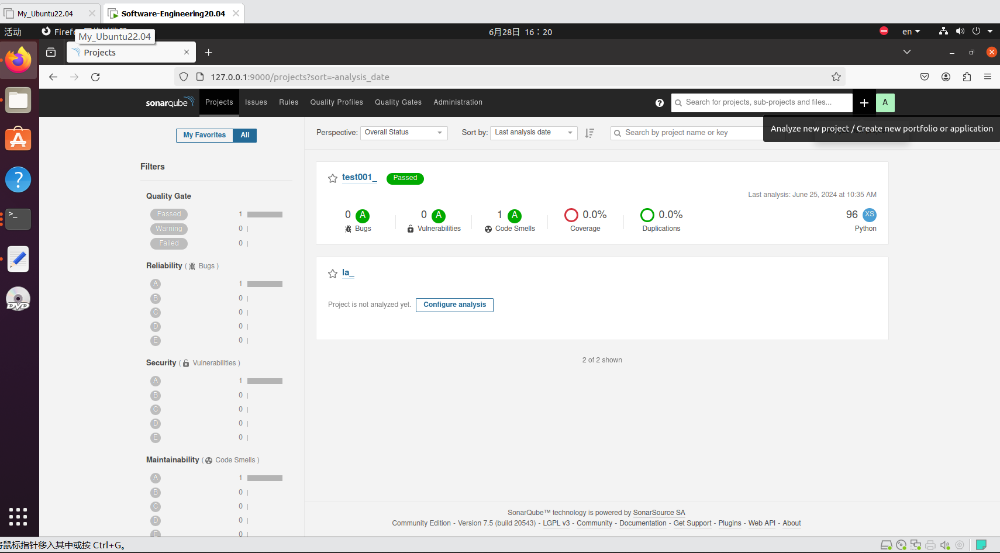
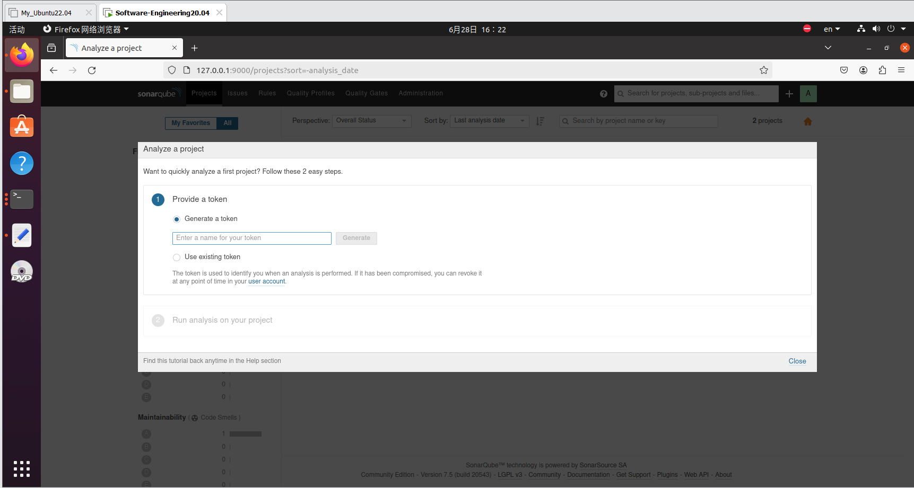
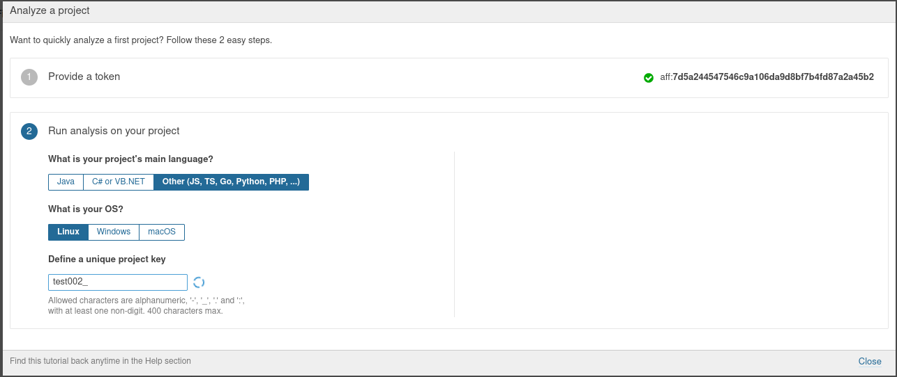
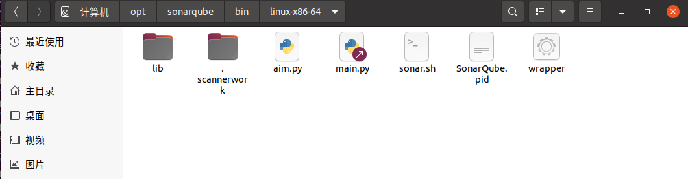
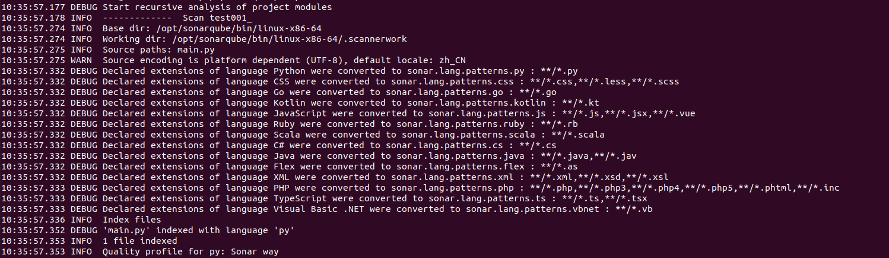
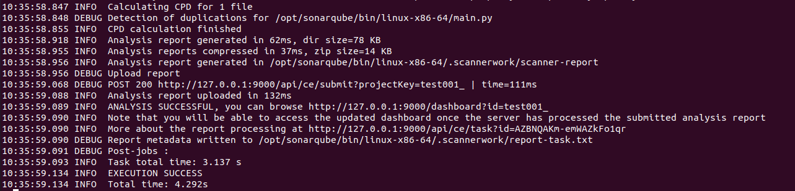

### Software-Engineering2024 代码质量评估模块

#### 预先配置

```
sudo sysctl -w vm.max_map_count=262144
sudo sysctl -w fs.file-max=65536
ulimit -n 65536
ulimit -u 4096
```

#### 安装openJDK

```
sudo apt-get install openjdk-8-jdk -y
sudo apt-get install openjdk-8-jre -y
```

#### 安装和设置 PostgreSQL 10 数据库

允许启动时自启动
```
sudo sh -c 'echo "deb http://apt.postgresql.org/pub/repos/apt/ `lsb_release -cs`-pgdg main" >> /etc/apt/sources.list.d/pgdg.list'
wget -q https://www.postgresql.org/media/keys/ACCC4CF8.asc -O - | sudo apt-key add -
sudo apt-get -y install postgresql postgresql-contrib
sudo systemctl start postgresql
sudo systemctl enable postgresql
```
更改PostgreSQL 用户的密码
切换到 PostgreSQL shell创建新用户，为 SonarQube 数据库的新创建用户设置密码(我这里设置的用户名和密码都是sonar)

```
sudo passwd postgres
su - postgres
createuser sonar
psql
ALTER USER sonar WITH ENCRYPTED password 'sonar';
CREATE DATABASE sonarqube OWNER sonar;
grant all privileges on DATABASE sonarqube to sonar;
```
从 psql 退出切换回 sudo 用户
``` 
\q
exit
```
#### 配置sonarqube
下载文件，把其中sonarqube文件夹下载到/opt文件夹里。
```
git clone https://github.com/StudyJudy/Software-Engineering2024.git
```
如果有意外的话，可以用下面的方式安装sonarqube
``` 
sudo wget https://binaries.sonarsource.com/Distribution/sonarqube/sonarqube-7.9.5.zip
sudo unzip sonarqube-7.9.5.zip -d /opt
sudo mv /opt/sonarqube-7.9.5 /opt/sonarqube
```
不能以root用户来运行Sonarqube，如果使用root用户运行，它会自动停止。下面创建sonar用户和组

创建sonar用户和组，然后修改/opt/sonarqube/conf/sonar.properties文件

``` 
sudo groupadd sonar
sudo useradd -c "user to run SonarQube" -d /opt/sonarqube -g sonar sonar
sudo chown sonar:sonar /opt/sonarqube -R
sudo nano /opt/sonarqube/conf/sonar.properties
```
配置PostgreSQL 数据库用户名和密码，并添加 Postgres 连接字符串

```
sonar.jdbc.username=sonar
sonar.jdbc.password=sonar
sonar.jdbc.url=jdbc:postgresql://localhost:5432/sonarqube
```

编辑SonarQube脚本文件并设置RUN_AS_USER

```
sudo nano /opt/sonarqube/bin/linux-x86-64/sonar.sh
```
```
RUN_AS_USER=sonar
```
先停止sonarqube服务，为sonarqube创建一个系统服务文件
```
cd /opt/sonarqube/bin/linux-x86-64/
./sonar.sh stop
sudo nano /etc/systemd/system/sonar.service
```

```
[Unit]
Description=SonarQube service
After=syslog.target network.target
 
[Service]
Type=forking
 
ExecStart=/opt/sonarqube/bin/linux-x86-64/sonar.sh start
ExecStop=/opt/sonarqube/bin/linux-x86-64/sonar.sh stop
 
User=sonar
Group=sonar
Restart=always
 
LimitNOFILE=65536
LimitNPROC=4096
 
[Install]
WantedBy=multi-user.target
```
##### 启动sonarqube
切换到sonar用户，移动到脚本目录运行脚本启动 SonarQube
```
sudo su sonar
cd /opt/sonarqube/bin/linux-x86-64/
./sonar.sh start
```

检查sonarqube是否运行

```
./sonar.sh status
tail /opt/sonarqube/logs/sonar.log
```

设置让sonarqube系统服务在启动时自动运行

```
sudo systemctl start sonar
sudo systemctl enable sonar
sudo systemctl status sonar
```
开启服务后，打开浏览器访问
```
http://127.0.0.1:9000
```
登录 SonarQube 的默认管理员用户名和密码都是admin

#### 配置sonar-scanner
下载，将sonar-scanner文件夹也放置在/opt文件夹里
```
git clone https://github.com/StudyJudy/Software-Engineering2024.git
```
如果有意外的话，可以进入下面的网站下载sonar-scanner并解压缩，同样放置在/opt文件夹里
```
https://docs.sonarqube.org/latest/analysis/scan/sonarscanner/
```
进入sonar-scanner文件夹里的conf文件夹，找到sonar-scanner.properties，进行如下初始设置
```
sonar.host.url=http://localhost:9000
sonar.login=admin
sonar.password=admin
```
```
SONAR_SCANNER_OPTS="-Dsonar.host.url=http://127.0.0.1:9000 --add-opens java.base/java.lang=ALL-UNNAMED"
```
```
export SONAR_SCANNER_OPTS="--add-opens java.base/java.lang=ALL-UNNAMED"
```
这一行也要加上，要不还是运行不起来

##### 配置环境变量

```
sudo vim /etc/profile
```
```
export SONAR_RUNNER_HOME=/opt/sonar-scanner
export PATH=$SONAR_RUNNER_HOME/bin:$PATH
```
其中SONAR_RUNNER_HOME是安装sonar-scanner的路径
保存修改，并查看是否安装成功

```
source /etc/profile
sonar-scanner -v
```
#### sonarqube使用

右上角的加号可以创建新项目


在这里token的name随便输入就好




以我自己之前创建好的test001_项目（项目的名字是自己起的）为例，命令行命令如下
```
/opt/sonar-scanner/bin/sonar-scanner -X \
  -Dsonar.projectKey=test001_ \
  -Dsonar.sources=./main.py \
  -Dsonar.host.url=http://127.0.0.1:9000 \
  -Dsonar.login=140b663a6653643593dbba1ea64291eb3f60adfd
```
以这个main.py文件为例，这个文件放置在/opt/sonarqube/bin/linux-x86-64目录下

但是因为权限问题，只能通过命令行的复制方式将代码文件复制到这个目录下，直接复制粘贴不可以，改变文件夹权限就直接失败了（我也不是很清楚为什么）
在原始代码文件目录下，

```
sudo cp -r filename /opt/sonarqube/bin/linux-x86-64
```
然后这个login后面这串token就是生成的那个token
执行效果如下


能看到EXECUTION SUCCESS就是执行成功了，分析的报告在report-task.txt中

##### 可视化的功能需求：

· 代码文件上传页面，并且将文件通过命令行的方式复制到/opt/sonarqube/bin/linux-x86-64目录下
· 在进入sonar用户，且cd /opt/sonarqube/bin/linux-x86-64/，./sonar.sh start确认启动后，需要执行命令进行代码质量分析的工作，我之后可以把我的虚拟机直接clone一份，就可以直接使用test001_这个项目，login那行也不用改，只需更改sources那行，把文件名字改了就好。

```
/opt/sonar-scanner/bin/sonar-scanner -X \
  -Dsonar.projectKey=test001_ \
  -Dsonar.sources=./main.py \
  -Dsonar.host.url=http://127.0.0.1:9000 \
  -Dsonar.login=140b663a6653643593dbba1ea64291eb3f60adfd
```
· 可视化直接连接到sonarqube的这个test_001项目的展示页面就好，是什么样就是什么样hh，也省事

· 关于代码质量分析文件的下载，感觉不下载也行其实，略过也好，反正这边已经可视化展示出来了


#### 单元测试
安装openai的包，安装最新版本会报错
```
pip install openai==0.28
```
正常是可以运行的，可以进行自动化单元测试样例的生成，但是现在api里没有余额了所以不管怎样都是已超额...所以异常报错的输出直接改成了已生成单元测试样例文件，就是暂时写死了直接。。。

这个也可以在ubuntu里运行，就是改文件路径（code_file_path和unit_test_file_path）就可以
执行命令```python test_aim.py```即可进行自动化单元测试，输出如下（正常情况可以正常执行，但是为防止gpt生成的代码有问题，不管有没有问题都写死通过全部单元测试样例了）：


##### 可视化需求：
· 输出通过全部单元测试样例即可，输出文字形式或饼图形式均可（反正暂时是直接写死了已经hh）

